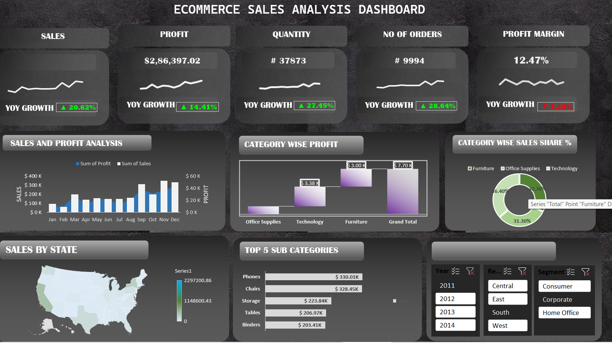

# 📊 Ecommerce Sales Analysis Dashboard


An interactive **Ecommerce Sales Dashboard** built using **Microsoft Excel** to analyze sales performance, profitability, customer orders, and category-wise trends.

---

## 📸 Dashboard Preview

> Upload your dashboard image inside the repository and rename it to **dashboard.png**



---
## 📑 Table of Contents

- [Dashboard Preview](#-dashboard-preview)
- [Project Overview](#-project-overview)
- [Key Performance Indicators (KPIs)](#-key-performance-indicators-kpis)
- [Features](#-features)
- [Tools Used](#-tools-used)
- [Dataset](#-dataset)
- [Business Insights](#-business-insights)
- [Project Files](#-project-files)
- [How to Use](#-how-to-use)
- [Author](#-author)
## 🚀 Project Overview

This dashboard helps businesses monitor key performance indicators (KPIs) and gain actionable insights from sales data.

---

## 📌 Key Performance Indicators (KPIs)

- 💰 Total Sales
- 💵 Total Profit
- 📦 Total Quantity Sold
- 🛒 Total Orders
- 📈 Profit Margin
- 📊 Year-over-Year (YoY) Growth

---

## ✨ Features

- KPI Cards
- Monthly Sales Analysis
- Sales vs Profit Comparison
- Category-wise Profit Analysis
- Category-wise Sales Share
- YoY Growth Indicators
- Interactive Dashboard Design

---
## 📊 Dashboard Highlights

- KPI Cards (Sales, Profit, Orders, Quantity, Profit Margin)
- Sales and Profit Analysis
- Category-wise Profit Analysis
- Category-wise Sales Share
- Year-over-Year (YoY) Growth
- Interactive Dashboard Design
---

## 🛠 Tools Used

- Microsoft Excel
- Pivot Tables
- Pivot Charts
- Slicers
- Conditional Formatting
- Excel Formulas
- Dashboard Design

---
## 💡 Skills Demonstrated

- Microsoft Excel
- Pivot Tables
- Pivot Charts
- Data Visualization
- Dashboard Design
- Business Analysis
- KPI Reporting
- Conditional Formatting
- Excel Formulas
---
## 📂 Dataset

Superstore Sales Dataset

---

## 📈 Business Insights

- Technology category generated the highest profit.
- Furniture contributed the lowest profit margin.
- Sales peaked during the festive season.
- Although sales increased, profit margin declined.

---

## 📁 Project Files

```text
📦 Ecommerce-Sales-Dashboard
│── Ecommerce analysis.xlsx
│── Ecommerce analysis(1).pdf
│── dashboard-esa.png
│── README.md
```
## 🚀 How to Use

1. Download **Ecommerce analysis.xlsx** from this repository.
2. Open the file using **Microsoft Excel** (Excel 2016 or later is recommended).
3. If Excel displays a security warning, click **Enable Editing**.
4. Navigate to the **Dashboard** sheet.
5. Explore the KPIs, charts, and visualizations.
6. Use the slicers (if available) to filter and analyze the data.
---

## 👨‍💻 Author

**Milind Khorgade**

- GitHub: https://github.com/milind007K

---

## ⭐ If you like this project

Give this repository a ⭐ on GitHub.
